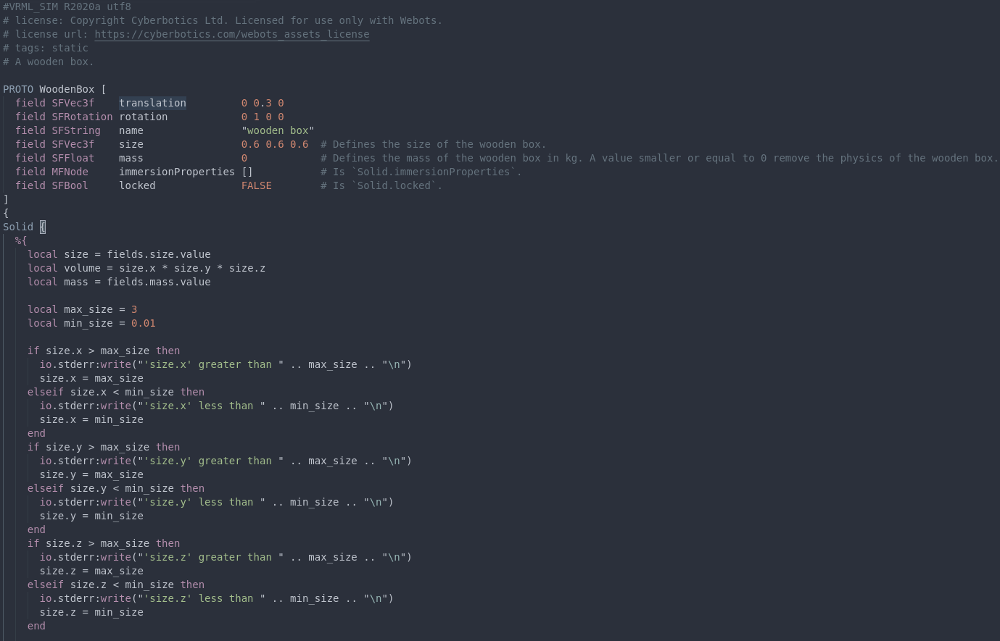

# language-proto-webots
Based on the Atom extension https://github.com/tn12787/PROTO-Webots

## Features
Webots-flavoured PROTO Syntax Highlighting Support in VSCode !
Support for all Webots nodes, as well as complete Lua support for advanced PROTOs.

## Known Issues
Feel free to contribute, this grammar may be incomplete.

## Release Notes
### 0.0.1
Initial release based on the Atom extension
